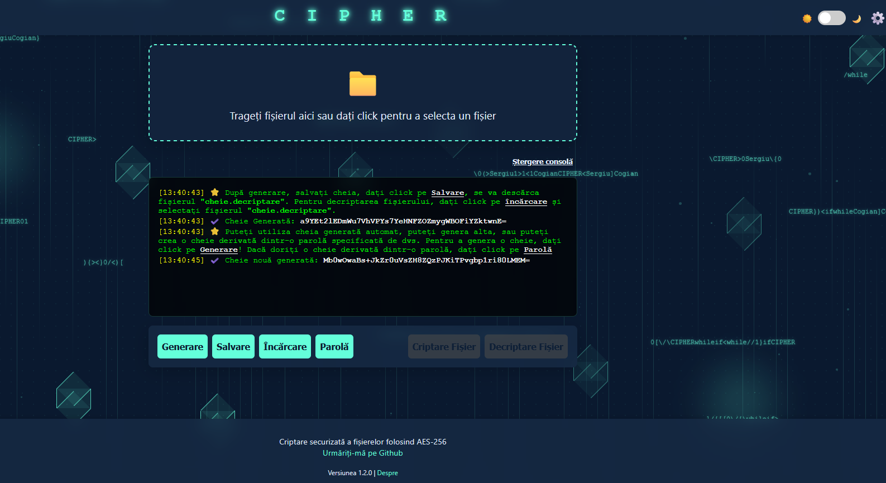
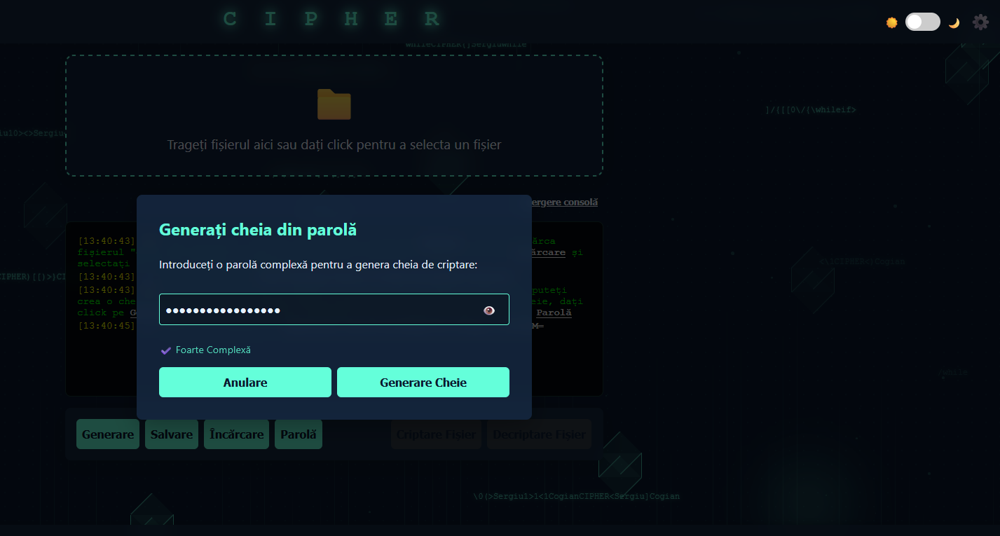
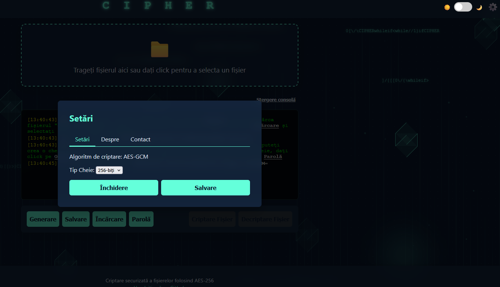

# 🔐 C I P H E R

**CIPHER** este o aplicație web de criptare și decriptare a fișierelor, construită cu accent pe securitate, confidențialitate și design modern. Utilizează algoritmul de criptare **AES-GCM (AES-256)**, implementat complet în browser, fără a trimite vreodată fișierele către un server.

> 🔒 Criptarea are loc **exclusiv pe dispozitivul utilizatorului** folosind **Web Crypto API**.

---

## 🚀 Caracteristici principale

- ✅ **Criptare AES-256 (GCM)** – utilizată în medii militare
- ✅ **Criptare locală** – fișierele NU părăsesc dispozitivul tău
- ✅ **Compatibilitate Offline** – aplicația funcționează și fără conexiune la internet
- ✅ **Mod întunecat integrat** – comutare temă cu un simplu click
- ✅ **Derivare cheie din parolă** – cu indicator de complexitate
- ✅ **Interfață responsive și animată** – design modern cu efecte vizuale dinamice
- ✅ **Suport pentru fișiere prin drag & drop**
- ✅ **Salvare/încărcare chei de criptare**
- ✅ **Tab-uri cu Setări, Despre și Contact**
- ✅ **Sistem de log (consolă) în aplicație** cu timestamp

---

## 📷 Capturi de ecran

| Interfața principală | Modal parolă | Setări |
|----------------------|--------------|--------|
|  |  |  |

---

## 🔧 Cum se utilizează

1. **Deschide aplicația** într-un browser care suportă Web Crypto API (Chrome, Firefox, Edge).
2. **Încarcă un fișier** prin drag & drop sau click.
3. **Generează o cheie:**
   - Automată (`Generare`)
   - Sau derivată din parolă (`Parolă`)
4. **Salvează cheia** (`Salvare`) – va fi utilizată ulterior pentru decriptare.
5. **Criptează fișierul** (`Criptare Fișier`) – se va descărca automat fișierul `original.criptat`.
6. **Decriptează fișierul** (`Decriptare Fișier`) – selectează fișierul `.criptat` și cheia (`Încărcare`).

---

## ⚠️ Note de securitate

- 🔴 **Important**: Dacă pierzi cheia, **nu există nicio metodă de recuperare a fișierului criptat**.
- 🔐 Salvează fișierul `cheie.decriptare` într-un mediu sigur (ex: USB, cloud securizat).
- 🔐 Pentru partajare, poți trimite fișierul criptat + cheia, iar destinatarul îl poate decripta cu aceeași aplicație (ex: [https://cript.rf.gd](https://cript.rf.gd)).

---

## 📦 Tehnologii utilizate

- `HTML5`, `CSS3` (design responsive + animații)
- `JavaScript (ES6+)`
- `Web Crypto API`
- `Blob API` și `FileReader API` pentru manipulare fișiere
- `LocalStorage` pentru păstrarea modului întunecat

---

## 🔒 Compatibilitate

| Browser        | Suportat |
|----------------|----------|
| Chrome         | ✅ Da    |
| Firefox        | ✅ Da    |
| Edge (Chromium)| ✅ Da    |
| Safari         | ⚠️ Parțial (verifică suport WebCrypto + drag&drop) |
| Internet Explorer | ❌ Nu |

---

## 👨‍💻 Dezvoltator

**Cogian Sergiu**  
📧 Email: [neurici@gmail.com](mailto:neurici@gmail.com)  
🐙 GitHub: [@neurici](https://github.com/neurici)

---

## 📜 Licență

Distribuit sub licența **MIT**. Vezi fișierul [LICENSE](LICENSE) pentru detalii.

---

## 💡 Sugestii & Contribuții

PR-urile sunt binevenite! Dacă ai idei de funcționalități sau ai descoperit un bug, deschide un [issue](https://github.com/neurici/CIPHER/issues) sau trimite un pull request.

---

## ✅ TODO (versiuni viitoare)

- [ ] Suport pentru criptare multiplă (fișiere multiple)
- [ ] Salvează setările local (persistență preferințe utilizator)
- [ ] Generare automată de parolă complexă
- [ ] Posibilitate de redenumire automată a fișierului criptat
- [ ] Semnătură digitală pentru verificarea integrității fișierului

---

**🔐 CIPHER — Criptează inteligent. Protejează totul. Fără server. Fără urme. 100% client-side.**
